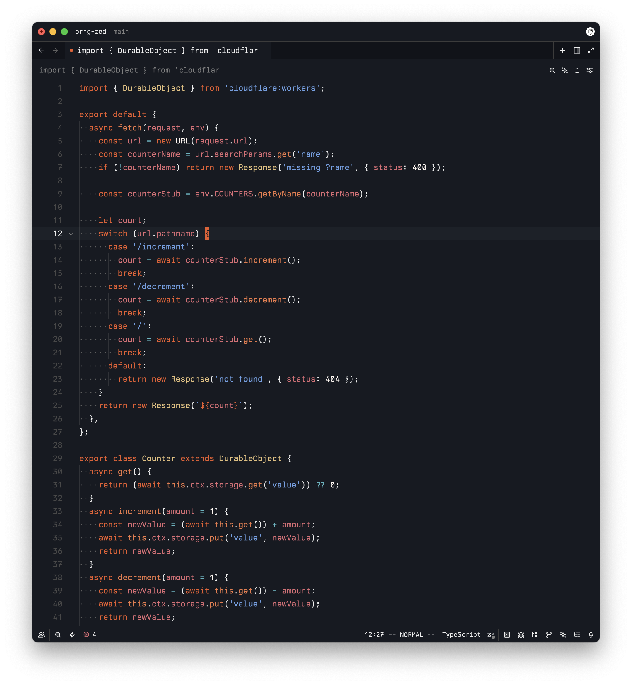
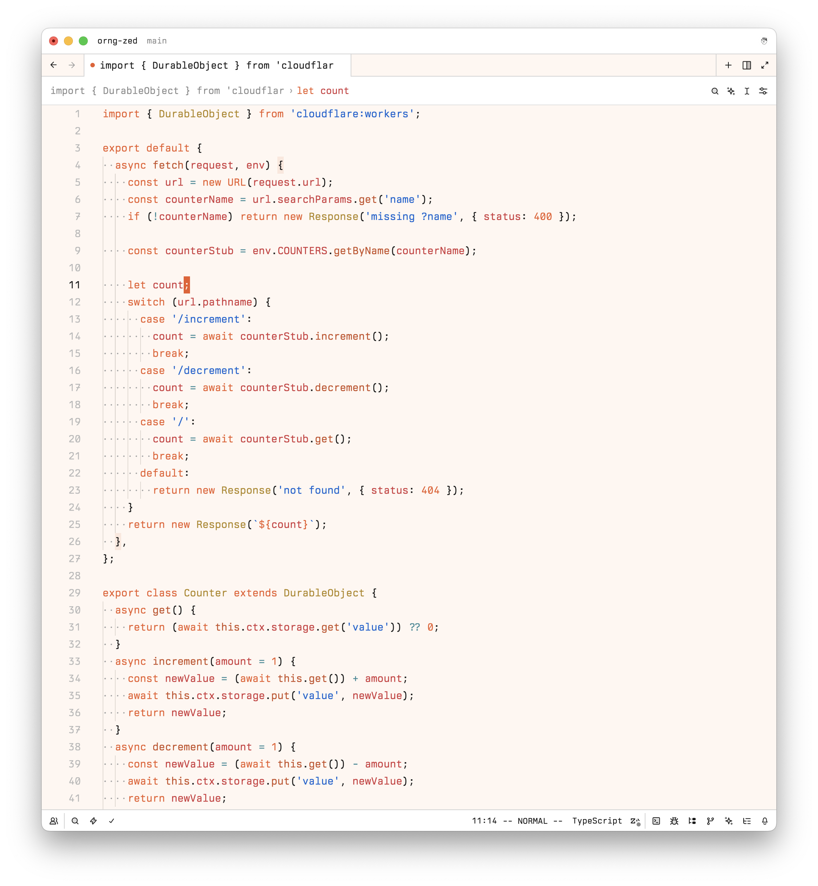

# Cloudflare "orng" Themes for Zed

[](https://zed.dev/extensions/orng)

`orng` is a Cloudflare-inspired set of themes (dark + light) for the [Zed](https://zed.dev/) text editor and based on the color scheme used @ [workers.dev](https://workers.dev/).

## What does it look like?

### Dark mode



### Light mode



## Installation & Usage

1. Install the theme via the Extensions gallery (shift+ctrl/cmd+x) -> filter for `orng`.
2. Open the theme selector (`cmd+k, cmd+t`)
3. Select `orng Dark` or `orng Light`

Manually: open your Zed user settings.json: `~/.config/zed/settings.json`, and add this config:

```json
{
  "theme": {
    "mode": "system",
    "light": "orng Light",
    "dark": "orng Dark"
  }
}
```

You can also clone this repo and install it as a dev extension: useful if you want to iterate and/or test changes/fixes. `shift+cmd+p` -> `zed: install dev extension` -> choose the top-level dir you cloned.

Refer to the [Zed docs on extensions](https://zed.dev/docs/extensions/installing-extensions) for more details beyond what this simple README can provide you.

## License

Apache-2.0. (c) 2025 Cloudflare, Inc.
